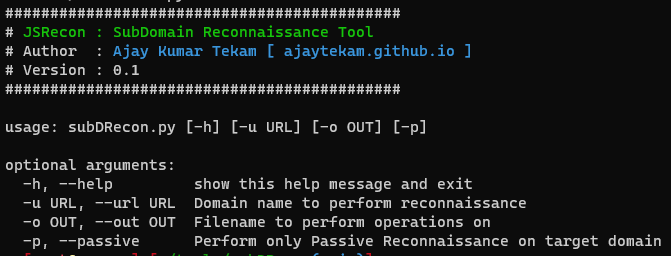

## subDRecon 

Automated SubDomain Reconnaissance script. 

   

__How it Works :__     

* Collect subdomains from active and passive methods using amass, assetfinder, findomain. 
* Generate subdomain using dnsgen and commonspeak2.  
* varify all the live subdomains via dns bruteforcing using massdns.     

__Tools used :__      

* [amass](https://github.com/OWASP/Amass)   
* [assetfinder](https://github.com/tomnomnom/assetfinder)   
* [findomain](https://github.com/Findomain/Findomain)  
* [dnsgen](https://github.com/ProjectAnte/dnsgen)   
* [massdns](https://github.com/blechschmidt/massdns)   

__Install Requirements :__   

```  
pip3 install -r requirements.txt
```  

__Usage :__     

```  
usage: subDRecon.py [-h] [-u URL] [-o OUT] [-p]

optional arguments:
  -h, --help         show this help message and exit
  -u URL, --url URL  Domain name to perform reconnaissance
  -o OUT, --out OUT  Filename to perform operations on
  -p, --passive      Perform only Passive Reconnaissance on target domain
```  


__Telegram Bot :__ Needs to be added `/root/notificationConfig.ini` file on server.    

```
[telegram]
apiToken = snldasdsljdffsdfvsd.....
chatId = 1234567
```
